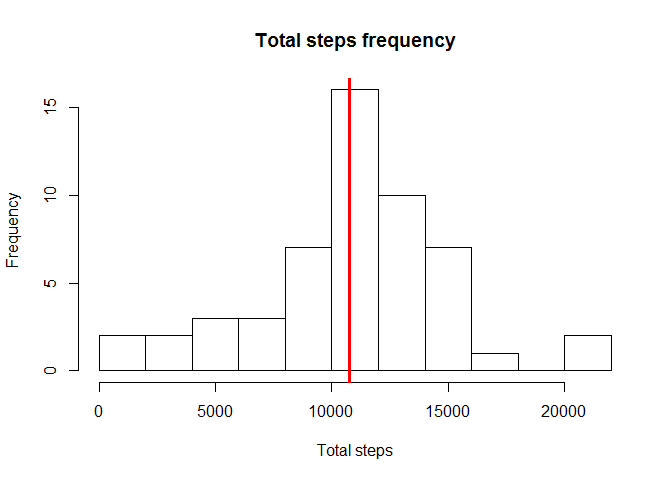
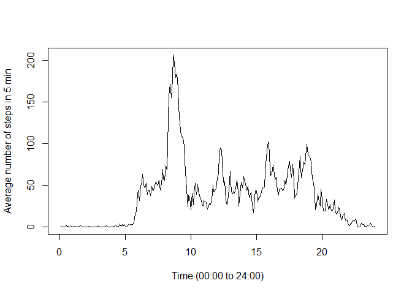
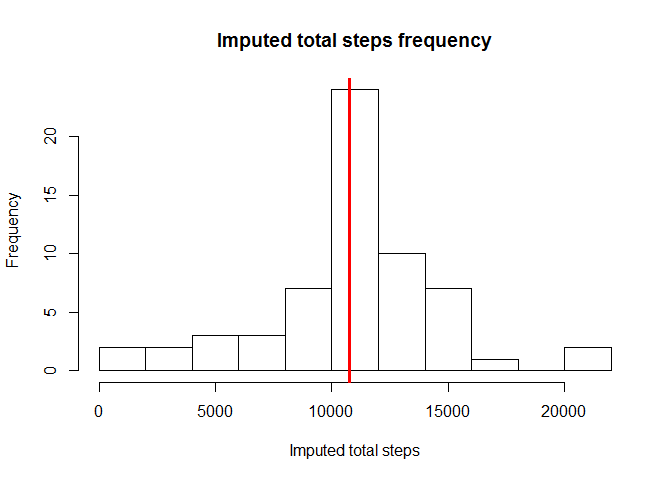
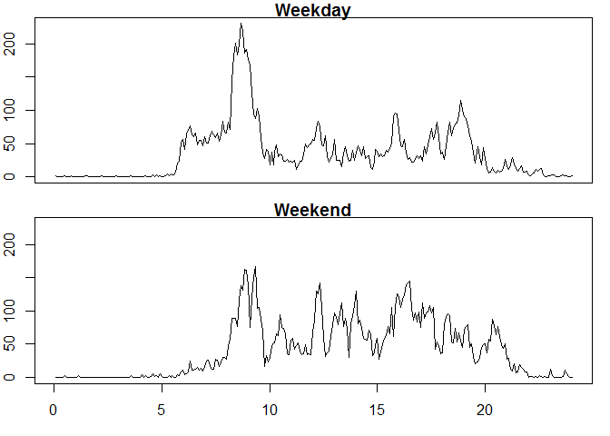

# Reproducible Research: Peer Assessment 1


## Loading and preprocessing the data

```r
Sys.setlocale("LC_TIME", "English")
```

```
## [1] "English_United States.1252"
```

```r
library(reshape)
activity_long<-read.csv("activity.csv")
activity<-cast(activity_long, date ~ interval, value='steps')
```


## What is mean total number of steps taken per day?

```r
totalsteps<-rowSums(activity[,2:289])
hist(totalsteps, breaks=10, xlab="Total steps", main="Total steps frequency")
abline(v=mean(totalsteps, na.rm=TRUE), col="red", lwd=3)
```

 

Mean of daily total steps (without NAs): 1.0766189\times 10^{4}  
Median of daily total steps (without NAs): 1.0765\times 10^{4}  
Mean and median is almost equal.


## What is the average daily activity pattern?


```r
ans<-colMeans(activity,na.rm=TRUE)
plot(c(1:288)/12, ans, type="l", xlab="Time (00:00 to 24:00)", ylab="Average number of steps in 5 min")
```

 

Maximum number of steps (average: 206.1698113) taken between 08:35 and 08:40.


## Imputing missing values
There are 8 days with missing data.

```r
library(Hmisc)
# fill missing values from average number of steps vector (as integer)
activity.i<-cbind(activity[,1],as.data.frame(t(apply(activity[,2:289], 1, function(t){as.integer(impute(t,ans))}))))
colnames(activity.i)<-colnames(activity)

totalsteps.i<-rowSums(activity.i[,2:289])
hist(totalsteps.i, breaks=10, xlab="Imputed total steps", main="Imputed total steps frequency")
abline(v=mean(totalsteps.i, na.rm=TRUE), col="red", lwd=3)
```

 


Mean of daily total steps (without NAs): 1.0766189\times 10^{4}  
Mean of daily total steps (imputed): 1.074977\times 10^{4}  
Median of daily total steps (without NAs): 1.0765\times 10^{4}  
Median of daily total steps (imputed): 1.0641\times 10^{4}  

Both mean and median are decreased by this imputation.

## Are there differences in activity patterns between weekdays and weekends?

```r
activity.i$isWeekend<-weekdays(as.Date(activity[,1])) %in% c("Saturday","Sunday")
ansWeekend<-colMeans(activity.i[activity.i$isWeekend,2:289])
ansWeekday<-colMeans(activity.i[!activity.i$isWeekend,2:289])
ylim=max(ansWeekend,ansWeekday)
par(mfrow=c(2,1), mar=c(1,2,1,1), oma=c(2,0,0,0))
plot(c(1:288)/12, ansWeekday, type="l", xlim=NULL,ylim=c(0,ylim), mar=0, main="Weekday", xaxt="n")
plot(c(1:288)/12, ansWeekend, type="l", ylim=c(0,ylim), mar=0, main="Weekend")
```

 

